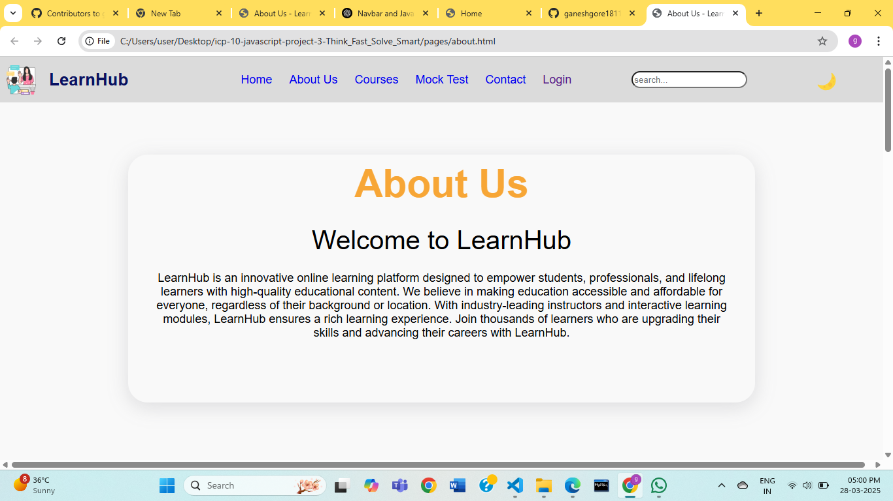
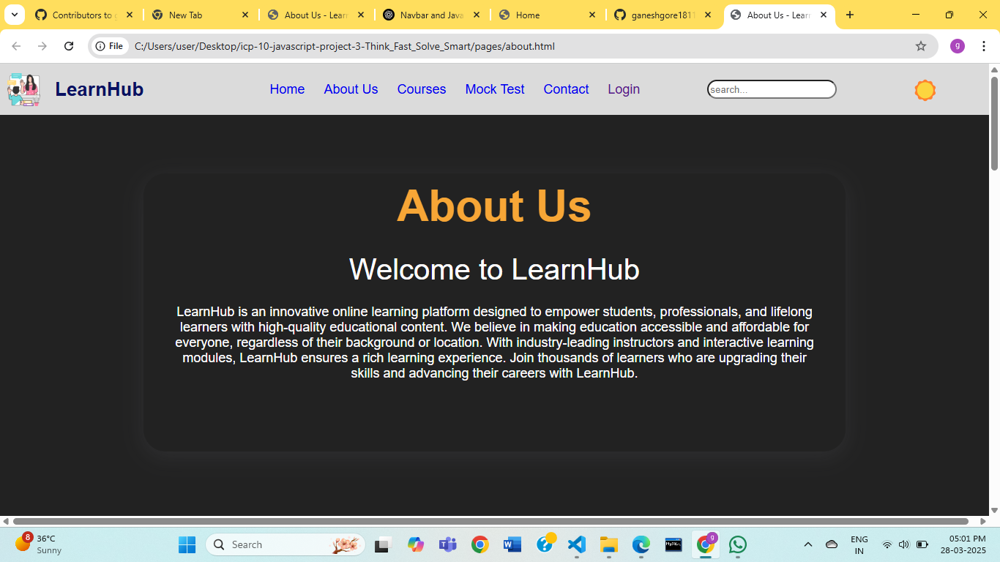

# ***Think_Fast_Solve_Smart🌟***
### Website link: https://think-fast-solve-smart.netlify.app

## ***Hi! I'm happy to see you here!***
#### Welcome to Think_Fast_Solve_Smart! This is a educational, and interactive website designed for Student. Think_Fast_Solve_Smart offers a variety of quizzes and Mock Test on your technical Knowledge, Verbal , Qualitative, and Reasoning aptitude test to encourage learning through play🚀.

## Aboutus

LearnHub is an innovative online learning platform designed to empower students,professionals, and lifelong learners with high-quality educational content.We believe in making education accessible and affordable for everyone, regardless of their background or location.
With industry-leading instructors and interactive learning modules, LearnHub ensures a rich learning experience.Join thousands of learners who are upgrading their skills and advancing their careers with LearnHub.

## Features

- About us
- Mock_Test
- Login Profile for user
- Contact us
- Free and Open-Source Platform
- Interactive Design: User-friendly interface with engaging graphics and stickers.
- Responsive Layout: Optimized for mobile, tablet, and desktop devices.

## Our Quizzes-Category
- Numerical Ability: Test your skills in arithmetic, percentages, ratios, and number series.
- Logical Reasoning: Evaluate your ability to solve patterns, puzzles, and logical sequences.
- Logical Reasoning: Evaluate your ability to solve patterns, puzzles, and logical sequences.
-Coding Aptitude: Solve programming-based logical questions (for IT roles).

#### We making this project for dark mode also gives very interactive and responsive layout. ####

## Contributors

 

## Support

**If you find our projects helpful or interesting, consider giving them a ⭐ it means our lot of us!!!**